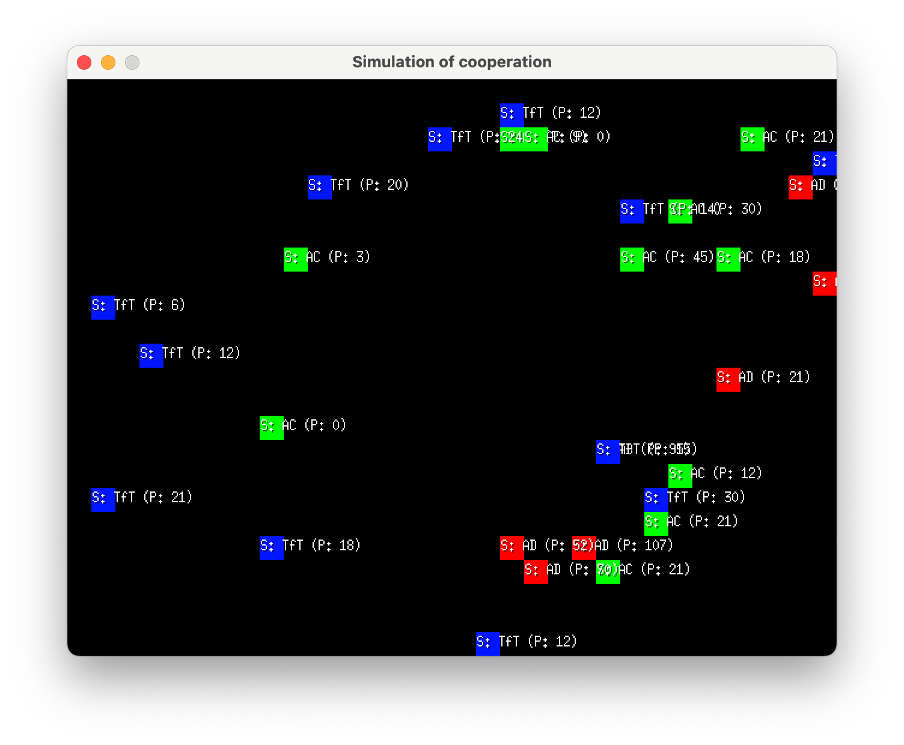

# tit-for-tat-simulation

This is an agent-based simulation written in Go that aims to demonstrate the "benefits" (measured in points reached) of the following behaviors: always cooperating, always defecting, or [tit-for-tat](https://en.wikipedia.org/wiki/Tit_for_tat).

Each agent initialized its strategy randomly. So every population for the simulation is a little bit different. And oo the amount of "sheeps", "wolfs" and "strategists" differs and as a result, the simulation takes a fundamentally different course.

The simulation runs per default in a 640x480 pixel fixed window and looks quite basic. It was a small fun project I created for myself while learning simulations in Go.

An agent-based simulation is kind of like watching a bunch of drunk, stumbling people doing whatever it is they're doing. That's intentional, by the way.